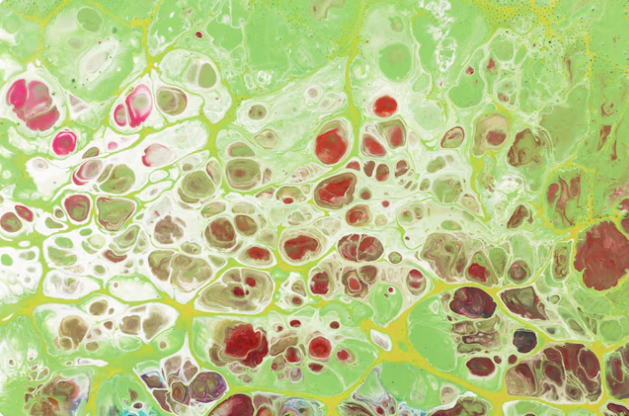

# GLADYS ARANEDA

## Perfil

**Disciplina / formación:**  DISEÑADORA

**Qué hago hoy:**  DOCENTE DE DISEÑO, UNIVERSIDAD AUSTRAL DE CHILE

**Qué me gustaría aprender en este curso:**  VISUALIZACIÓN DE DATOS

## Intereses

- COMUNICACIÓN MATERIAL
- ENVASES
- DOCENCIA

## Una pregunta que me interesa explorar

Envolventes responsivas 
Criterios de diseño para envolventes responsivas y la comunicación del estado interno de productos hidrobiológicos

## Algo que me inspira

## Links

- [Referencia 1](https://www.mimicalab.com/)

- [Referencia 2](https://example.com)

> No es necesario publicar información personal que no quieras compartir. Este README será parte de un repositorio público durante el laboratorio.
